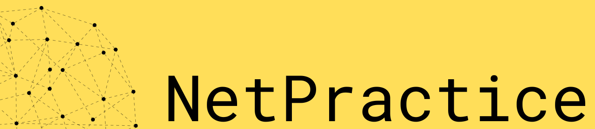
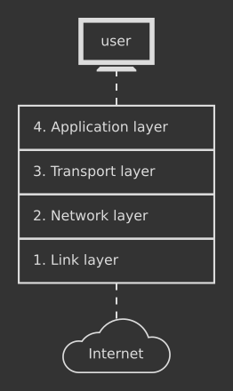

> **¿Quieres ver 42 Quebec en 3D?**
> **:arrow_right: https://mini42qc.vercel.app/ :arrow_left:**

# Guide to NetPractice



<div id="top"></div>

## Otros idiomas

[Korean](README.ko.md)
<br>
[French](README.fr.md)
<br>
[English](README.md)

## Tabla de contenido

- [Conceptos importantes](#conceptos-importantes)
  - [TCP](#tcp-capa-de-transporte)
  - [dirección IP](#dirección-ip-capa-de-red)
  - [Máscara de subred](#máscara-de-subred)
  - [Switch](#switch)
  - [Router](#router)
- [Niveles](#niveles)

---

## Conceptos importantes

### TCP: capa de transporte

</br>
<p align="center">
  
</p>
</br>

TCP es el acrónimo de **Transmission Control Protocol** (Protocolo de control de transmisión). Es un estándar de comunicaciones que permite que los programas de aplicación y los dispositivos intercambien mensajes a través de una red. Se utiliza para enviar paquetes a través de Internet.

TCP garantiza la integridad de los datos que se comunican a través de una red. Antes de transmitir datos, TCP establece una conexión entre un origen y su destino, que permanece activa hasta que comienza la comunicación. Luego divide grandes cantidades de datos en paquetes más pequeños, al tiempo que garantiza la entrega de un extremo a otro sin pérdida de datos.

<div align="right">
  <b><a href="#top">↥ volver arriba</a></b>
</div>
</br>

---

### Dirección IP: Capa de red

</br>
<p align="center">
  <kbd></kbd>
</p>
</br>

IP es parte de un conjunto de protocolos de Internet, que también incluye el protocolo de control de transmisión. Juntos, estos dos se conocen como TCP/IP. El conjunto de protocolos de Internet rige las reglas para empaquetar, direccionar, transmitir, enrutar y recibir datos a través de redes.

El direccionamiento IP es un medio lógico de asignar direcciones a dispositivos en una red. Cada dispositivo conectado a Internet requiere una dirección IP única.

Una dirección IP tiene dos partes; una parte identifica el host, como una computadora u otro dispositivo, y la otra parte identifica la red a la que pertenece. TCP/IP utiliza una [máscara de subred](#máscara-de-subred) para separarlos.
</br>
</br>

#### IPv4 vs. IPv6

Las direcciones IP vienen en 2 versiones: IPv4 e IPv6:
<br>

<p align="center">
  <kbd></kbd>
</p>
<br>

El Protocolo de Internet versión 4 (IPv4) define una dirección IP como un número de 32 bits. Sin embargo, debido al crecimiento de Internet y al agotamiento de las direcciones IPv4 disponibles, en 1998 se estandarizó una nueva versión de IP (IPv6), que utiliza 128 bits para la dirección IP. Sin embargo, en NetPractice sólo se utilizan direcciones IPv4.
</br>
</br>

#### Dirección pública vs. Dirección privada

Una dirección IP pública es una dirección IP a la que se puede acceder directamente a través de Internet y que su proveedor de servicios de Internet (ISP) asigna a su enrutador de red. Una dirección IP pública (o externa) le ayuda a conectarse a Internet desde dentro y fuera de su red.

Una dirección IP privada es una dirección que su enrutador de red asigna a su dispositivo. A cada dispositivo dentro de la misma red se le asigna una dirección IP privada única (a veces llamada dirección de red privada); así es como los dispositivos en la misma red interna se comunican entre sí.

Cuando una red está conectada a Internet, no puede utilizar una dirección IP de las direcciones IP privadas reservadas. Los siguientes rangos están reservados para direcciones IP privadas:

```
192.168.0.0 – 192.168.255.255 (65,536 dirección IP)
172.16.0.0 – 172.31.255.255   (1,048,576 dirección IP)
10.0.0.0 – 10.255.255.255     (16,777,216 dirección IP)
```

<div align="right">
  <b><a href="#top">↥ volver arriba</a></b>
</div>
</br>

---

### Máscara de subred

</br>
<p align="center">
  <kbd></kbd>
</p>
</br>

Una máscara de subred es una dirección de 32 bits (4 bytes) que se utiliza para distinguir entre una dirección de red y una dirección de host en la dirección IP. Define el rango de direcciones IP que se pueden utilizar dentro de una red o subred.
</br>
</br>

#### Encontrar la dirección de red

La _Interfaz A1_ anterior tiene las siguientes propiedades:

```
Dirección IP | 104.198.241.125
Máscara      | 255.255.255.128
```

Para determinar qué parte de la dirección IP es la dirección de red, debemos aplicar la máscara a la dirección IP. Primero conviertamos la máscara a su forma binaria:

```
Máscara | 11111111.11111111.11111111.10000000
```

Los bits de una máscara que son 1 representan la dirección de red, mientras que los bits restantes de una máscara que son 0 representan la dirección del host. Ahora conviertamos la dirección IP a su forma binaria:

```
Dirección IP | 01101000.11000110.11110001.01111101
Máscara      | 11111111.11111111.11111111.10000000
```

Ahora podemos aplicar la máscara a la dirección IP a través de una operación [AND bit a bit](https://en.wikipedia.org/wiki/Bitwise_operation#AND) para encontrar la dirección de red de la IP:

```
Dirección de red | 01101000.11000110.11110001.00000000
```

Lo que se traduce en una dirección de red de `104.198.241.0`.
</br>
</br>

#### Encontrar el rango de direcciones de host

Para determinar qué direcciones de host podemos usar en nuestra red, tenemos que usar los bits de nuestra dirección IP dedicados a la dirección de host. Usemos nuestra dirección IP y máscara anteriores:

```
Dirección IP | 01101000.11000110.11110001.01111101
Máscara      | 11111111.11111111.11111111.10000000
```

El rango posible de nuestras direcciones de host se expresa a través de los últimos 7 bits de la máscara, que son todos 0. Por lo tanto, el rango de direcciones de host es:

```
BINARIO | 0000000 - 1111111
DECIMAL | 0 - 127
```

Para obtener el rango de direcciones IP posibles para nuestra red, agregamos el rango de direcciones de host a la dirección de red. Nuestro rango de posibles direcciones IP pasa a ser `104.198.241.0 - 104.198.241.127`.

<ins>SIN EMBARGO</ins>, los extremos del rango están reservados para usos específicos y no pueden usarse en una interfaz:

```
104.198.241.0   | Reservado para representar la dirección de red.
104.198.241.127 | Reservado como dirección de transmisión; Se utiliza para enviar paquetes a todos los hosts de una red.
```

Por lo tanto, nuestro rango de IP real es `104.198.241.1 - 104.198.241.126`, que podría haberse encontrado usando una [calculadora de IP](https://www.calculator.net/ip-subnet-calculator.html).
</br>
</br>

#### Notación CIDR (/24)

La máscara también se puede representar con el Classless Inter-Domain Routing (CIDR). Este formulario representa la máscara como una barra diagonal "/", seguida del número de bits que sirven como dirección de red.

Por lo tanto, la máscara en el ejemplo anterior de `255.255.255.128`,es equivalente a una máscara de `/25` usando la notación CIDR, ya que 25 bits de 32 bits representan la dirección de red.

<div align="right">
  <b><a href="#top">↥ volver arriba</a></b>
</div>
</br>

---

### Switch

</br>
<p align="center">
  <kbd></kbd>
</p>
</br>

Un switch (conmutador) conecta varios dispositivos en una sola red. A diferencia de un router (enrutador), el switch no tiene ninguna interfaz, ya que solo distribuye paquetes a su red local y no puede comunicarse directamente con una red fuera de la suya.

<div align="right">
  <b><a href="#top">↥ volver arriba</a></b>
</div>
</br>

---

### Router

</br>
<p align="center">
  <kbd></kbd>
</p>
</br>

Así como el switch conecta varios dispositivos en una sola red, el router conecta varias redes juntas. El router tiene una interfaz para cada red a la que se conecta.

Dado que el router separa diferentes redes, el rango de posibles direcciones IP en una de sus interfaces no debe superponerse con el rango de sus otras interfaces. Una superposición en el rango de direcciones IP implicaría que las interfaces están en la misma red.
</br>
</br>

#### Tabla de enrutamiento

</br>
<p align="center">
  <kbd></kbd>
</p>
</br>

Una tabla de enrutamiento es una tabla de datos almacenada en un router o host de red que enumera las rutas a destinos de red particulares. En NetPractice, la tabla de enrutamiento consta de 2 elementos:

- **Destination**: El destino especifica una dirección de red en la que un host es el destino final de los paquetes. La ruta `default` o `0.0.0.0/0`, es la ruta que entra en vigor cuando no hay otra ruta disponible para una dirección IP de destino. La ruta predeterminada utilizará la dirección del siguiente salto para enviar los paquetes en su camino sin proporcionar un destino específico. La ruta predeterminada coincidirá con cualquier red.

- **Next hop**: El next hop (siguiente salto) se refiere al siguiente router más cercano por el que puede pasar un paquete. Es la dirección IP del siguiente router en el camino del paquete. Cada router mantiene su tabla de enrutamiento con una dirección de siguiente salto.

<div align="right">
  <b><a href="#top">↥ volver arriba</a></b>
</div>
</br>

## Niveles

<details>
  <summary>Nivel 1</summary>
  <br>
  
  <br>
  <br>

**1.** Dado que el _Cliente A_ y el _Cliente B_ están en la misma red, su dirección IP debe representar la misma red de acuerdo con la máscara de subred.
<br>
La máscara de subred es _255.255.255.0_, lo que significa que los primeros 3 bytes de la dirección IP representan la red y el cuarto byte representa el host. Como estamos en la misma red, sólo el host puede cambiar.
<br>
La solución será cualquier valor en el rango de **104.96.23.0 - 104.96.23.255** excluyendo los 3 siguientes:

- **104.96.23.0:** El primer número en el rango de hosts (0 en este caso) representa la red y un host no puede utilizarlo.
- **104.96.23.255:** El último número en el rango de hosts (255 en este caso) representa la dirección de transmisión.
- **104.96.23.12:** Esta dirección ya la utiliza el host _Cliente B_.

**2.** El mismo razonamiento que _1._, sin embargo, la máscara de subred es _255.255.0.0_ en este caso. Los primeros 2 bytes de la dirección IP representarán la red; y los últimos 2 bytes, la dirección del host.
<br>
La solución será cualquier valor en el rango **211.191.0.0 - 211.191.255.255**, excluyendo:

- **211.191.0.0:** Representa la dirección de red.
- **211.191.255.255:** Representa la dirección de transmisión.
- **211.191.89.75:** Ya tomado por el host _Cliente C_.

<div align="right">
  <b><a href="#top">↥ volver arriba</a></b>
</div>
</br>

</details>

---

<details>
  <summary>Nivel 2</summary>
  <br>
  
  <br>
  <br>

**1.** Dado que el _Cliente B_ está en la misma red privada que el _Cliente A_, deben tener exactamente la misma máscara de subred.
<br>
La solución sólo puede ser **255.255.255.224**.

**2.** Para comprender la máscara de subred de _255.255.255.224_, veámosla en forma binaria, junto con la IP _192.168.20.222_ del _Cliente B_:

<center>

```
Máscara: 11111111.11111111.11111111.11100000
IP:      11000000.10101000.00010100.11011101
```

</center>
Como podemos ver, los primeros 27 bits representan la dirección IP, mientras que sólo los últimos 5 bits representan la dirección del host.
<br>
Todos estos 27 bits que representan la red deben permanecer iguales en las direcciones IP de los hosts de la misma red. Para obtener la respuesta, sólo podemos cambiar los últimos 5 bits.
<br>
<br>
La respuesta está en el rango de:

```
BIN:  11000000.10101000.00010100.11000000 - 11000000.10101000.00010100.11011111
o
DEC:  192.168.20.192 - 192.168.20.223
```

Excluyendo:
<br>

- **11000000.10101000.00010100.11000000:** Representa la dirección de red (observe los 0 en los últimos 5 bits).
- **11000000.10101000.00010100.11011111:** Representa la dirección de transmisión (observe los 1 en los últimos 5 bits).
- **11000000.10101000.00010100.11011110:** El _Cliente B_ ya tiene esa dirección.

**3.** Aquí se presenta la notación de barra diagonal "/" para la máscara de subred en la _Interfaz D1_. Una máscara de subred de _/30_ significa que los primeros 30 bits de la dirección IP representan la dirección de red y los 2 bits restantes representan la dirección del host:

<center>

```
Máscara /30: 11111111.11111111.11111111.11111100
```

</center>

Podemos ver que este número binario corresponde al decimal _255.255.255.252_, por lo tanto es idéntico a la máscara que se encuentra en la _Interfaz C1_.
<br>
<br>
Las respuestas pueden ser entonces cualquier dirección, siempre que cumplan las siguientes condiciones:

- La dirección de red (primeros 30 bits) debe ser idéntica para _Cliente D_ y _Cliente C_.
- Los bits del host (últimos 2 bits) no pueden ser todos 1 ni todos 0.
- _Cliente D_ y _Cliente C_ no tienen direcciones IP idénticas.

<div align="right">
  <b><a href="#top">↥ volver arriba</a></b>
</div>
</br>

</details>

---

<details>
  <summary>Nivel 3</summary>
  <br>
  
  <br>
  <br>

Este ejercicio presenta el uso del **switch** (_Switch S_ en este ejemplo). El switch vincula varios hosts de la misma red.
<br>
<br>

**1.** _Cliente A_, _Cliente B_ y _Cliente C_ están todos en la misma red. Por tanto, todos deben tener la misma máscara de subred. Dado que _Cliente C_ ya tiene la máscara _255.255.255.128_, la máscara para _Interfaz B1_ y para _Interfaz A1_ también será _255.255.255.128_ (o en notación de barra diagonal: _/25_).
<br>
<br>
La dirección IP de _Interfaz B1_ y _Interfaz C1_ debe estar en el mismo rango de red que la IP del _Cliente A_. Este rango es:

  <center>

```
104.198.241.0 - 104.198.241.128
```

  </center>
  Excluyendo, por supuesto, la dirección de red y la dirección de transmisión.

  <div align="right">
  <b><a href="#top">↥ volver arriba</a></b>
</div>
</br>

</details>

---

<details>
  <summary>Nivel 4</summary>
  <br>
  
  <br>
  <br>

Este ejercicio presenta el **router** (enrutador). El router se utiliza para vincular varias redes. Lo hace con el uso de múltiples interfaces (_Interface R1_, _Interface R2_ e _Interface R3_ en este ejemplo).
<br>
<br>

**1.** Dado que no se ingresa ninguna de las máscaras en _Interfaz B1_, _Interfaz A1_ e _Interfaz R1_, somos libres de elegir nuestra propia máscara de subred. Una máscara de **/24** es ideal ya que nos deja con el cuarto byte completo para la dirección del host y no requiere cálculos binarios para encontrar el rango de posibles direcciones de host.
<br>
<br>
La dirección IP de _Interfaz B1_ y _Interfaz R1_ debe tener la misma dirección de red que la dirección IP de _Interfaz A1_. Con una subred de _/24_, el rango posible es:

  <center>

```
85.17.5.0 - 85.17.5.255
```

  </center>
  Excluyendo la dirección de red y la dirección de transmisión.
  <br>
  <br>

Tenga en cuenta que no interactuamos con el router _Interface R2_ y _Interface R3_, ya que ninguna de nuestras comunicaciones tenía que llegar a estos lados del router.

  <div align="right">
  <b><a href="#top">↥ volver arriba</a></b>
</div>
</br>

</details>

---

<details>
  <summary>Nivel 5</summary>
  <br>
  
  <br>
  <br>

Este nivel presenta **rutas**. Una ruta contiene 2 campos, el primero es el **destino** (destination) de los paquetes salientes, el segundo es el **siguiente salto** (next hop) de los paquetes.
<br>

El **destino** _predeterminado_ es equivalente a _0.0.0.0/0_, que enviará los paquetes indiscriminadamente a la primera dirección de red que encuentre. Una dirección de destino de _122.3.5.3/24_ enviaría los paquetes a la red _122.3.5.0_.

  <br>
  El **siguiente salto** es la dirección IP de la siguiente interfaz del router (o Internet) a la que la interfaz de la máquina actual debe enviar sus paquetes.
  <br>
  <br>

**1.** El _Cliente A_ solo tiene 1 ruta a través de la cual puede enviar sus paquetes. No sirve de nada especificar un destino numerado. El destino _predeterminado_ enviará los paquetes a la única ruta disponible.
<br>
<br>
La dirección del siguiente salto debe ser la dirección IP de la interfaz del siguiente router en el camino de los paquetes. La siguiente interfaz es _Interfaz R1_, con la dirección IP de _54.117.30.126_. Tenga en cuenta que la siguiente interfaz no es _Interfaz A1_, ya que es la interfaz del propio remitente.

  <div align="right">
  <b><a href="#top">↥ volver arriba</a></b>
</div>
</br>

</details>

---

<details>
  <summary>Nivel 6</summary>
  <br>
  
  <br>
  <br>

Este nivel presenta **Internet**. Internet se comporta como un router. Sin embargo, si una interfaz está conectada directa o indirectamente a Internet, **no puede** tener una dirección IP en los siguientes rangos de IP privados reservados:

```
192.168.0.0 - 192.168.255.255 (65,536 IP addresses)
172.16.0.0 - 172.31.255.255   (1,048,576 IP addresses)
10.0.0.0 - 10.255.255.255     (16,777,216 IP addresses)
```

**1.** El **siguiente salto** de Internet ya está ingresado y coincide con la dirección IP de la _Interfaz R2_. Por lo tanto sólo debemos preocuparnos del destino de Internet.
<br>
<br>
Internet debe enviar sus paquetes al _Cliente A_. Para hacerlo, el destino de Internet debe coincidir con la dirección de red del _Cliente A_. Busquemos la dirección de red del _Cliente A_:
<br>
La máscara del _Cliente A_ es _255.255.255.128_, que equivale a _/25_. Esto significa que los primeros 25 bits de su dirección IP son su dirección de red. Sabemos entonces que los primeros 3 bytes (24 bits) de su dirección IP forman parte de su dirección de red:

  <center>

```
40.178.145.?
```

  </center>

Ahora sólo necesitamos saber si el bit 25 es un 1 o un 0.
<br>
Si convertimos el número 227 a binario, obtenemos "11100011". El primer dígito, que corresponde al bit 25, es un 1. Dado que solo el bit 25 es parte de la dirección de red y no los 7 bits restantes, obtenemos `10000000` para el último byte de la dirección de red, que es 128 en decimales.
<br>
<br>
La dirección de red completa es:

  <center>

```
40.178.145.128
```

  </center>

Con un rango de _40.178.145.129 - 40.178.145.254_ para sus direcciones de host.
<br>
<br>
Ya podemos poner esta dirección de **40.178.145.128** en el destino de Internet. El **/25** que sigue a la dirección de destino representa la máscara aplicada a su dirección.
<br>
<br>
Un destino de _40.178.145.227/25_ es equivalente a la dirección de destino _40.178.145.128/25_, ya que la máscara de _/25_ convertirá todos los bits después del 25 a 0 para obtener la dirección de red del destino.

  <div align="right">
  <b><a href="#top">↥ volver arriba</a></b>
</div>
</br>

</details>

---

<details>
  <summary>Nivel 7</summary>
  <br>
  
  <br>
  <br>

Este nivel introduce el concepto de **superposiciones** (overlaps). El rango de direcciones IP de una red no debe superponerse al rango de direcciones IP de una red separada. Las redes están separadas por routers (enrutadores).
<br>
<br>

**1.** Contamos con 3 redes separadas:
<br>

1. Entre _Client A_ y _Router R1_.
2. Entre _Router R1_ y _Router R2_.
3. Entre _Router R2_ y _Client C_.

Para _Interfaz A1_, no podemos elegir nuestra dirección IP libremente ya que la IP de _Interfaz R11_ ya está ingresada. Además, si le damos una máscara de _/24_, el rango de direcciones IP se superpondrá con el rango de _Interfaz R12_, que ya está ingresado. Ambos estarían en el rango de _93.198.14.0 - 93.198.14.255_.
<br>
<br>

Como necesitamos direcciones para 3 redes separadas, es conveniente dividir los últimos bytes de la dirección en 4 o más rangos de direcciones. Hacemos esto usando una máscara de _/26_ o superior. La máscara de _/28_ por ejemplo nos dará 16 rangos, de los cuales usamos los siguientes 3:

```
93.198.14.1 - 93.198.14.14    (Client A al Router R1)
93.198.14.65 - 93.198.14.78   (Router R1 al Router R2)
93.198.14.241 - 93.198.14.254 (Router R2 al Client C)
```

Para calcular los posibles rangos de una máscara:
<br>
https://www.calculator.net/ip-subnet-calculator.html?cclass=any&csubnet=28&cip=93.198.14.2&ctype=ipv4&printit=0&x=97&y=13

  <div align="right">
  <b><a href="#top">↥ volver arriba</a></b>
</div>
</br>

</details>

---

<details>
  <summary>Nivel 8</summary>
  <br>
  
  <br>
  <br>

**1.** Los hosts _Cliente C_ y _Cliente D_ enviarán paquetes a Internet, luego Internet responderá enviando paquetes hasta el remitente inicial. Para enviar estos paquetes, Internet utiliza el destino _49.175.13.0/26_ para enviar los paquetes a las redes en el rango de `49.175.13.0 - 49.175.13.63`.
<br>
<br>
Todas las redes receptoras deben estar en este rango, sin superponerse entre sí.
<br>
<br>

**2.** En _Interface R23_ y _Interface R22_ usamos la máscara _255.255.255.240_ (o _/28_), para dividir convenientemente el rango de _/26_ de la dirección de destino, en 4 rangos separados. Esta separación de 4 es necesaria ya que tenemos las siguientes 3 redes que no deben superponerse:
<br>

1. _Router R1_ al _Router R2_.
2. _Router R2_ al _Client C_.
3. _Router R2_ al _Client D_.

A cada una de estas redes se le puede atribuir uno de los siguientes rangos de IP con una máscara de _/28_:

```
49.175.13.0 - 49.175.13.15
49.175.13.16 - 49.175.13.31
49.175.13.32 - 49.175.13.47
49.175.13.48 - 49.175.13.63
```

Tenga en cuenta que la dirección de red (primera) y la dirección de transmisión (última) deben excluirse de cada rango.
<br>
<br>

**3.** El destino y el próximo salto de Internet ya están ingresados. Solo necesitamos ingresar el siguiente salto para el _Router R2_, que es la IP en la _Interfaz R21_.

<div align="right">
  <b><a href="#top">↥ volver arriba</a></b>
</div>
</br>

</details>

---

<details>
  <summary>Nivel 9</summary>
  <br>
  
  <br>
  <br>

Este nivel es bastante sencillo ya que Internet inicialmente no envía sus paquetes a una red específica. Por lo tanto, no es necesario que las redes separadas compartan un rango de direcciones común. Sugeriría simplemente seguir los 6 objetivos del nivel uno por uno hasta completar el nivel.
<br>
<br>
Recuerde no utilizar las direcciones de red de los rangos de IP privados reservados.
<br>
<br>

**1.** **El objetivo 3** establece que debemos conectar _meson_ con _internet_. Luego, _Internet_ tendrá que responder a _meson_, por lo que ingresamos la dirección de red de _meson_ en el destino de _Internet_.
<br>
<br>
**El objetivo 6** establece que debemos conectar _cation_ con _internet_, por lo que ingresamos la dirección de red de _cation_ en el destino de _internet_.
<br>
<br>
Es normal tener un campo vacío para el tercer destino de _internet_, y en el destino del _Router R1_. No es necesario completar todos los campos de las tablas de enrutamiento.

  <div align="right">
  <b><a href="#top">↥ volver arriba</a></b>
</div>
</br>

</details>

---

<details>
  <summary>Nivel 10</summary>
  <br>
  
  <br>
  <br>

En este nivel existen 4 redes diferentes:
<br>

1. _Router R1_ al _Switch S1_
2. _Router R1_ al _Router R2_
3. _Router R2_ al _Client H4_
4. _Router R2_ al _Client H3_
<br>

**1.** Internet debe poder enviar sus paquetes a todos los hosts, por lo que su destino debe cubrir el rango de redes de todos los hosts.
<br>
<br>

_Interface R11_ y _Interface R13_ ya tienen una dirección IP ingresada. Esta dirección IP sólo se diferencia en su último byte. La _Interfaz R11_ tiene como último byte **1** y la _Interfaz R13_ tiene como último byte **254**. Para cubrir este amplio rango de direcciones IP, tomamos una máscara de **/24** para el destino de Internet. Este destino cubrirá un rango de `70.101.30.0 - 70.101.30.255`.
<br>
<br>

**2.** A la hora de elegir las direcciones IP debemos asegurarnos de 2 cosas:
<br>

1. La dirección IP está cubierta por el destino _internet_.
2. El rango de direcciones IP de las distintas redes no se superpone.
<br>

Con las direcciones IP ya ingresadas (atenuadas), examinemos los rangos cubiertos por las distintas redes:
<br>

1. _Router R1_ al _Switch S1_ - Cubre el rango **70.101.30.0 - 70.101.30.127** (Máscara /25).
2. _Router R2_ al _Client H4_ - Cubre el rango **70.101.30.128 - 70.101.30.191** (Máscara /26).
3. _Router R1_ al _Router R2_ - Cubre el rango **70.101.30.252 - 70.101.30.255** (Máscara /30).
4. _Router R2_ al _Client H3_ - ??? (Máscara ???).

Las únicas direcciones IP que quedan para la red "Router R2 to Client H3" son **70.101.30.192 - 70.101.30.251**. Podemos elegir cualquier máscara que nos permita tomar 2 direcciones IP de ese rango para colocarlas en _Interfaz R22_ e _Interfaz R31_.

  <div align="right">
  <b><a href="#top">↥ volver arriba</a></b>
</div>
</br>

</details>
