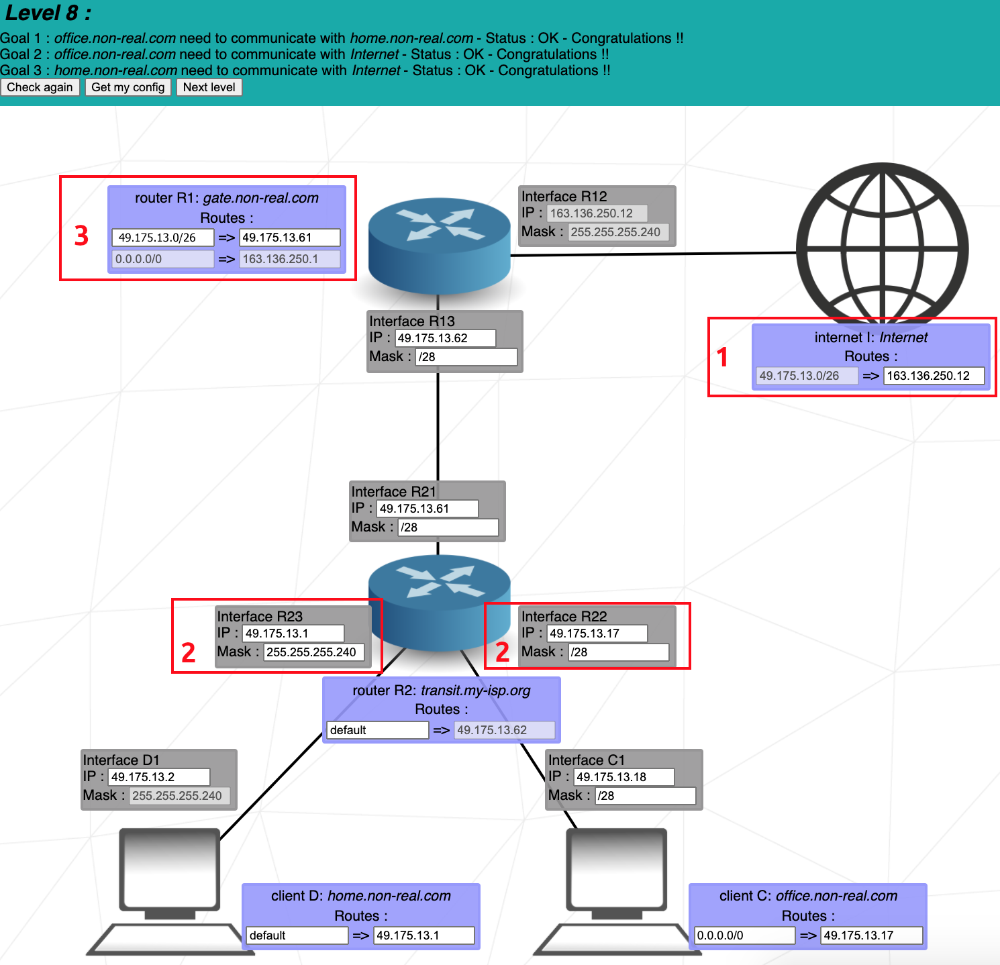

# Guide to NetPractice


<div id="top"></div>

## Autres langues

[Korean](README.ko.md)
<br>
[English](README.md)

## Sommaire

- [Concepts importants](#concepts-importants)
  - [TCP](#tcp-couche-de-transport)
  - [Adresse IP](#adresse-ip-couche-du-réseau)
  - [Masque de sous-réseau](#masque-de-sous-réseau)
  - [Switch](#switch)
  - [Routeur](#routeur)
- [Niveaux](#niveaux)

---

## Concepts importants

### TCP: Couche de transport

</br>
<p align="center">
  
</p>
</br>

TCP est l'accronyme de **Transmission Control Protocol** (protocole de controle des transmissions). C'est une norme de communication qui permet aux programmes d'application et aux appareils d'échanger des messages sur un réseau. Il est utilisé pour envoyer des paquets sur l'internet.

TCP garantie l'intégrité des données communiquées sur un réseau. Avant de transmettre des données, TCP établit une connexion entre une source et sa destination, qui reste active jusqu'à ce que la communication commence. Il divise ensuite de grandes quantités de données en paquets plus petits, tout en assurant une livraison de bout en bout sans perte de données.

<div align="right">
  <b><a href="#top">↥ retour en haut</a></b>
</div>
</br>

---

### Adresse IP: Couche du réseau

</br>
<p align="center">
  <kbd></kbd>
</p>
</br>

L'IP fait partie d'une suite de protocoles internet, qui comprend également le protocole de contrôle de la transmission (TCP). Ensemble, ces deux protocoles sont connus sous le nom de TCP/IP. La suite de protocoles internet régit les règles de mise en paquets, d'adressage, de transmission, de routage et de réception des données sur les réseaux.

L'adressage IP est un moyen logique d'attribuer des adresses aux appareils d'un réseau. Chaque appareil connecté à l'internet a besoin d'une adresse IP unique.

Une adresse IP se compose de deux parties : l'une identifie l'hôte, tel qu'un ordinateur ou un autre appareil, et l'autre identifie le réseau auquel il appartient. TCP/IP utilise un [masque de sous-réseau](#masque-de-sous-réseau) pour les séparer.
</br>
</br>

#### IPv4 vs. IPv6

Les adresses IP existent en deux versions : IPv4 et IPv6 :
<br>

<p align="center">
  <kbd></kbd>
</p>
<br>

Le protocole Internet version 4 (IPv4) définit une adresse IP comme un nombre 32 bits. Toutefois, en raison de la croissance de l'internet et de l'épuisement des adresses IPv4 disponibles, une nouvelle version du protocole IP (IPv6), utilisant 128 bits pour l'adresse IP, a été normalisée en 1998. Cependant, seules les adresses IPv4 sont utilisées dans NetPractice.
</br>
</br>

#### Adresse publique vs. adresse privée

Une adresse IP publique est une adresse IP accessible directement sur l'internet et attribuée à votre routeur de réseau par votre fournisseur d'accès à l'internet (FAI). Une adresse IP publique (ou externe) vous permet de vous connecter à l'internet à l'extérieur de votre réseau depuis l'intérieur de votre réseau.

Une adresse IP privée est une adresse que votre routeur réseau attribue à votre appareil. Chaque appareil au sein d'un même réseau se voit attribuer une adresse IP privée unique (parfois appelée adresse de réseau privé) - c'est ainsi que les appareils d'un même réseau interne communiquent entre eux.

Lorsqu'un réseau est connecté à l'internet, il ne peut pas utiliser une adresse IP provenant des adresses IP privées réservées. Les plages suivantes sont réservées aux adresses IP privées :

```
192.168.0.0 – 192.168.255.255 (65,536 adresses IP différentes)
172.16.0.0 – 172.31.255.255   (1,048,576 adresses IP différentes)
10.0.0.0 – 10.255.255.255     (16,777,216 adresses IP différentes)
```

<div align="right">
  <b><a href="#top">↥ retour en haut</a></b>
</div>
</br>

---

### Masque de sous-réseau

</br>
<p align="center">
  <kbd></kbd>
</p>
</br>

Un masque de sous-réseau est une adresse 32 bits (4 octets) utilisée pour faire la distinction entre une adresse réseau et une adresse hôte dans l'adresse IP. Il définit la plage d'adresses IP pouvant être utilisées au sein d'un réseau ou d'un sous-réseau.
</br>
</br>

#### Trouver l'adresse réseau

L'_Interface A1_ ci-dessus possède les caractéristiques suivantes :

```
Adresse IP | 104.198.241.125
Masque     | 255.255.255.128
```

Pour déterminer quelle partie de l'adresse IP est l'adresse réseau, nous devons appliquer le masque à l'adresse IP. Commençons par convertir le masque sous sa forme binaire :

```
Masque | 11111111.11111111.11111111.10000000
```

Les bits d'un masque qui sont à 1 représentent l'adresse réseau, tandis que les bits restants d'un masque qui sont à 0 représentent l'adresse hôte. Convertissons maintenant l'adresse IP sous sa forme binaire :

```
Adresse IP | 01101000.11000110.11110001.01111101
Masque     | 11111111.11111111.11111111.10000000
```

Nous pouvons maintenant appliquer le masque à l'adresse IP au moyen d'une [opération bit à bit AND (ET)](https://fr.wikipedia.org/wiki/Opération_bit_à_bit#AND) pour trouver l'adresse réseau de l'IP :

```
Adresse réseau | 01101000.11000110.11110001.00000000
```

Qui correspond à une adresse réseau de `104.198.241.0`.
</br>
</br>

#### Trouver la plage d'adresses hôtes

Pour déterminer les adresses hôtes que nous pouvons utiliser sur notre réseau, nous devons utiliser les bits de notre adresse IP dédiés à l'adresse hôte. Reprenons notre adresse IP et notre masque précédents :

```
Adresse IP | 01101000.11000110.11110001.01111101
Masque     | 11111111.11111111.11111111.10000000
```

La plage possible de nos adresses hôtes est exprimée par les 7 derniers bits du masque qui sont tous à 0. Par conséquent, la plage d'adresses hôtes est la suivante :

```
BINAIRE  | 0000000 - 1111111
DECIMAL  | 0 - 127
```

Pour obtenir la plage des adresses IP possibles pour notre réseau, nous ajoutons la plage des adresses hôtes à l'adresse réseau. Notre plage d'adresses IP possibles devient `104.198.241.0 - 104.198.241.127`.

<ins>[CEPENDANT](https://youtu.be/zown2TxK84I)</ins>, les extrémités de la plage (0 et 127 ici) sont réservées à des usages spécifiques et ne peuvent être données à une interface :

```
104.198.241.0   | Réservée pour représenter l'adresse réseau sans spécifier d'hôte.
104.198.241.127 | Réservée comme adresse de diffusion ; utilisée pour envoyer des paquets à tous les hôtes d'un réseau.
```

Par conséquent, notre plage IP réelle devient `104.198.241.1 - 104.198.241.126`, qui aurait pu être trouvée à l'aide d'un [calculateur d'IP](https://www.calculator.net/ip-subnet-calculator.html).
</br>
</br>

#### CIDR Notation (/24)

Le masque peut également être représenté par le CIDR (Classless Inter-Domain Routing, Routage Inter-Domaine sans Classe en français). Cette forme représente le masque sous la forme d'une barre oblique "/", suivie du nombre de bits qui constituent l'adresse du réseau.

Par conséquent, le masque dans l'exemple ci-dessus de `255.255.255.128`, est équivalent à un masque de `/25` en utilisant la notation CIDR, puisque 25 bits sur 32 bits représentent l'adresse du réseau.

<div align="right">
  <b><a href="#top">↥ retour en haut</a></b>
</div>
</br>

---

### Switch

</br>
<p align="center">
  <kbd></kbd>
</p>
</br>

Un switch permet de relier plusieurs appareils au sein d'un même réseau. Contrairement à un routeur, le switch n'a pas d'interfaces puisqu'il ne distribue des paquets qu'à son réseau local et ne peut pas communiquer directement avec un réseau autre que le sien.

<div align="right">
  <b><a href="#top">↥ retour en haut</a></b>
</div>
</br>

---

### Routeur

</br>
<p align="center">
  <kbd></kbd>
</p>
</br>

Tout comme le switch relie plusieurs appareils sur un même réseau, le routeur relie plusieurs réseaux entre eux. Le routeur possède une interface pour chaque réseau auquel il se connecte.

Étant donné que le routeur sépare différents réseaux, la plage d'adresses IP possibles sur l'une de ses interfaces ne doit pas se chevaucher avec la plage de ses autres interfaces. Un chevauchement de la plage d'adresses IP impliquerait que les interfaces se trouvent sur le même réseau.
</br>
</br>

#### Table de routage

</br>
<p align="center">
  <kbd></kbd>
</p>
</br>

Une table de routage est une table de données stockée dans un routeur ou un hôte réseau qui répertorie les itinéraires vers des destinations réseau particulières. Dans NetPractice, la table de routage se compose de 2 éléments :

- **Destination** : La destination spécifie une adresse réseau sur laquelle un hôte est la cible finale des paquets. La route `par défaut` ou `0.0.0.0/0` est la route qui prend effet lorsqu'aucune autre route n'est disponible pour une adresse de destination IP. La route par défaut utilise l'adresse du "saut suivant" pour envoyer les paquets sans donner de destination spécifique. La route par défaut correspond à n'importe quel réseau.

- **Saut suivant** : Le "saut suivant" désigne le routeur le plus proche par lequel un paquet peut passer. Il s'agit de l'adresse IP du routeur suivant sur le chemin du paquet. Chaque routeur maintient sa table de routage avec une adresse de "saut suivant".

<div align="right">
  <b><a href="#top">↥ retour en haut</a></b>
</div>
</br>

## Niveaux

<details>
  <summary>Niveau 1</summary>
  <br>
    
  <br>
  <br>

**1.** Puisque le _Client A_ et le _Client B_ sont sur le même réseau, leur adresse IP doit représenter le même réseau conformément au masque de sous-réseau.
<br>
Le masque de sous-réseau est _255.255.255.0_, ce qui signifie que les 3 premiers octets de l'adresse IP représentent le réseau, et le 4ème octet représente l'hôte. Comme nous sommes sur le même réseau, seul l'hôte peut changer.
<br>
La solution sera tout ce qui se trouve dans la plage **104.96.23.0 - 104.96.23.255** à l'exception des 3 suivants :

- **104.96.23.0** : Le premier chiffre de la plage d'hôtes (0 dans ce cas) représente le réseau et ne peut pas être utilisé par un hôte.
- **104.96.23.255** : Le dernier chiffre de la plage d'hôtes (255 dans ce cas) représente l'adresse de diffusion.
- **104.96.23.12** : Cette adresse est déjà utilisée par l'hôte _Client B_.

**2.** Le même raisonnement que _1._, mais le masque de sous-réseau est _255.255.0.0_ dans ce cas. Les deux premiers octets de l'adresse IP représentent le réseau et les deux derniers, l'adresse hôte.
<br>
La solution sera tout ce qui se trouve dans la plage **211.191.0.0 - 211.191.255.255**, à l'exception de :

- **211.191.0.0** : Représente l'adresse réseau.
- **211.191.255.255** : Représente l'adresse de diffusion.
- **211.191.89.75** : Déjà pris par l'hôte _Client C_.

<div align="right">
  <b><a href="#top">↥ retour en haut</a></b>
</div>
</br>

</details>

---

<details>
  <summary>Niveau 2</summary>
  <br>
  
  <br>
  <br>

**1.** Puisque le _Client B_ se trouve sur le même réseau privé que le _Client A_, ils doivent avoir exactement le même masque de sous-réseau.
<br>
La seule solution possible est **255.255.255.224**.

**2.** Pour comprendre le masque de sous-réseau _255.255.255.224_, regardons-le sous forme binaire, avec l'IP _192.168.20.222_ du _Client B_ :

<center>

```
MASQUE : 11111111.11111111.11111111.11100000
IP     : 11000000.10101000.00010100.11011101
```

</center>
Comme on peut le voir, les 27 premiers bits représentent l'adresse réseau, tandis que seuls les 5 derniers bits représentent l'adresse hôte.
<br>
Tous ces 27 bits représentant le réseau doivent rester identiques dans les adresses IP des hôtes du même réseau. Pour obtenir la réponse, il suffit de modifier les 5 derniers bits.
<br>
<br>
La réponse est dans la plage d'adresses :

```
BIN:  11000000.10101000.00010100.11000000 - 11000000.10101000.00010100.11011111
ou
DEC:  192.168.20.192 - 192.168.20.223
```

A l'exception de:
<br>

- **11000000.10101000.00010100.11000000** : Représente l'adresse du réseau (remarquez les 0 dans les 5 derniers bits).
- **11000000.10101000.00010100.11011111** : Représente l'adresse de diffusion (remarquez tous les 1 dans les 5 derniers bits).
- **11000000.10101000.00010100.11011110** : Le client B\_ utilise déjà cette adresse.

**3.** Nous introduisons ici la notation de la barre oblique "/" pour le masque de sous-réseau de l'_Interface D1_. Un masque de sous-réseau de _/30_ signifie que les 30 premiers bits de l'adresse IP représentent l'adresse réseau, et les 2 bits restants représentent l'adresse hôte :

<center>

```
Masque /30: 11111111.11111111.11111111.11111100
```

</center>

On constate que ce nombre binaire correspond au nombre décimal _255.255.255.252_, il est donc identique au masque trouvé sur l'_Interface C1_.
<br>
<br>
Les réponses peuvent alors être n'importe quelle adresse, pour autant qu'elles remplissent les conditions suivantes :

- L'adresse réseau (30 premiers bits) doit être identique pour le _Client D_ et le _Client C_.
- Les bits hôte (2 derniers bits) ne peuvent être ni tous à 1, ni tous à 0.
- Le _Client D_ et le _Client C_ ne peuvent pas avoir des adresses IP identiques.

<div align="right">
  <b><a href="#top">↥ retour en haut</a></b>
</div>
</br>

</details>

---

<details>
  <summary>Niveau 3</summary>
  <br>
  
  <br>
  <br>

Cet exercice présente l'utilisation du **switch** (_Switch S_ dans cet exemple). Le switch relie plusieurs hôtes d'un même réseau.
<br>
<br>

**1.** Les _Client A_, _Client B_, et _Client C_ se trouvent tous sur le même réseau. Ils doivent donc tous avoir le même masque de sous-réseau. Comme le _Client C_ a déjà le masque _255.255.255.128_, le masque de l'_Interface B1_ et de l'_Interface A1_ sera également _255.255.255.128_ (ou en notation slash : _/25_).
<br>
<br>
Les adresses IP de l'_Interface B1_ et de l'_Interface C1_ doivent se trouver dans la même plage de réseau que l'IP du _Client A_. Cette plage est la suivante :

  <center>

```
104.198.241.0 - 104.198.241.128
```

  </center>
  A l'exception bien sûr de l'adresse réseau sans hôte et de l'adresse de diffusion.

  <div align="right">
  <b><a href="#top">↥ retour en haut</a></b>
</div>
</br>

</details>

---

<details>
  <summary>Niveau 4</summary>
  <br>
  
  <br>
  <br>

Cet exercice présente le **routeur**. Le routeur est utilisé pour relier plusieurs réseaux entre eux. Pour ce faire, il utilise plusieurs interfaces (_Interface R1_, _Interface R2_ et _Interface R3_ dans cet exemple).
<br>
<br>

**1.** Comme aucun des masques des _Interface B1_, _Interface A1_ et _Interface R1_ n'est saisi, nous sommes libres de choisir notre propre masque de sous-réseau. Un masque de **/24** est idéal car il nous laisse l'intégralité du quatrième octet pour l'adresse hôte et ne nécessite pas de calculs binaires pour trouver la plage d'adresses hôtes possibles.
<br>
<br>
L'adresse IP de l'_Interface B1_ et de l'_Interface R1_ doit avoir la même adresse réseau que l'adresse IP de l'_Interface A1_. Avec un sous-réseau de _/24_, la plage possible est la suivante :

  <center>

```
85.17.5.0 - 85.17.5.255
```

  </center>
  A l'exception bien sûr de l'adresse réseau sans hôte et de l'adresse de diffusion, encore une fois.
  <br>
  <br>

Notez que nous n'avons pas interagi avec l'_Interface R2_ et l'_Interface R3_ du routeur, car aucune de nos communications ne devait atteindre ces côtés du routeur.

  <div align="right">
  <b><a href="#top">↥ retour en haut</a></b>
</div>
</br>

</details>

---

<details>
  <summary>Niveau 5</summary>
  <br>
  
  <br>
  <br>

Ce niveau introduit les **routes**. Une route contient 2 champs, le premier est la **destination** des paquets sortants, le second est le **saut suivant** des paquets.
<br>

La **destination** _default_ (par défaut) est équivalente à _0.0.0.0/0_, qui enverra les paquets sans distinction à la première adresse réseau qu'elle rencontrera. Une adresse de destination de _122.3.5.3/24_ enverra les paquets au réseau _122.3.5.0_.

  <br>
  Le **saut suivant** est l'adresse IP de l'interface du routeur suivant (ou de l'internet) vers laquelle l'interface de la machine actuelle doit envoyer ses paquets.
  <br>
  <br>

**1.** Le _Client A_ n'a qu'une seule route par laquelle il peut envoyer ses paquets. Il est inutile de spécifier une destination numérotée. La destination _default_ enverra les paquets vers le seul chemin disponible.
<br>
<br>
L'adresse du saut suivant doit être l'adresse IP de l'interface du routeur suivant sur le chemin des paquets. L'interface suivante est _Interface R1_, avec l'adresse IP de _54.117.30.126_. Notez que l'interface suivante n'est pas _Interface A1_, puisqu'il s'agit de l'interface de l'expéditeur.

  <div align="right">
  <b><a href="#top">↥ retour en haut</a></b>
</div>
</br>

</details>

---

<details>
  <summary>Niveau 6</summary>
  <br>
  
  <br>
  <br>

Ce niveau présente l'**internet**. L'internet se comporte comme un routeur. Cependant, si une interface est connectée directement ou indirectement à l'internet, elle **ne peut pas** avoir une adresse IP dans les plages d'IP privées réservées suivantes :

```
192.168.0.0 - 192.168.255.255 (65,536 addresses IP différentes)
172.16.0.0 - 172.31.255.255   (1,048,576 addresses IP différentes)
10.0.0.0 - 10.255.255.255     (16,777,216 addresses IP différentes)
```

**1.** Le **saut suivant** de l'internet est déjà saisi et correspond à l'adresse IP de l'_Interface R2_. Par conséquent, nous ne devons nous préoccuper que de la destination de l'internet.
<br>
<br>
L'internet doit envoyer ses paquets au _Client A_. Pour ce faire, la destination de l'internet doit correspondre à l'adresse réseau du _Client A_. Trouvons l'adresse réseau du _Client A_ :
<br>
Le masque du _client A_ est _255.255.255.128_, ce qui équivaut à _/25_. Cela signifie que les 25 premiers bits de son adresse IP constituent son adresse réseau. Nous savons donc que les 3 premiers octets (24 bits) de son adresse IP font partie de son adresse réseau :

  <center>

```
40.178.145.?
```

  </center>

Il ne nous reste plus qu'à déterminer si le 25e bit est un 1 ou un 0.
<br>
Si nous convertissons le nombre 227 en binaire, nous obtenons `11100011`. Le premier chiffre, qui correspond au 25e bit, est un 1. Seul le 25e bit fait partie de l'adresse réseau et non les 7 bits restants donc nous obtenons `10000000` pour le dernier octet de l'adresse réseau, qui est 128 en décimal.
<br>
<br>
L'adresse réseau complète est :

  <center>

```
40.178.145.128
```

  </center>

Avec une plage de _40.178.145.129 - 40.178.145.254_ pour ses adresses hôtes.
<br>
<br>
Nous pouvons maintenant placer cette adresse **40.178.145.128** dans la destination Internet. Le **/25** qui suit l'adresse de destination représente le masque appliqué à son adresse.
<br>
<br>
Une destination de _40.178.145.227/25_ est équivalente à l'adresse de destination _40.178.145.128/25_, puisque le masque de _/25_ mettra tous les bits après le 25eme à 0 pour obtenir l'adresse réseau de la destination.

  <div align="right">
  <b><a href="#top">↥ retour en haut</a></b>
</div>
</br>

</details>

---

<details>
  <summary>Niveau 7</summary>
  <br>
  
  <br>
  <br>

Ce niveau introduit le concept de **chevauchement**. La plage d'adresses IP d'un réseau ne doit pas chevaucher la plage d'adresses IP d'un autre réseau. Les réseaux sont séparés par des routeurs.
<br>
<br>

**1.** Nous disposons de trois réseaux distincts :
<br>

1. Entre le _Client A_ et le _Routeur R1_.
2. Entre le _Routeur R1_ et le _Routeur R2_.
3. Entre le _Routeur R2_ et le _Client C_.

Pour l'_Interface A1_, nous ne pouvons pas choisir librement notre adresse IP puisque l'IP de l'_Interface R11_ est déjà saisie. De plus, si nous lui donnons un masque de _/24_, la plage d'adresses IP se chevauchera avec celle de l'_Interface R12_, qui est déjà saisie. Elles seraient toutes deux comprises entre _93.198.14.0 et 93.198.14.255_.
<br>
<br>

Comme nous avons besoin d'adresses pour trois réseaux distincts, il est pratique de diviser les derniers octets de l'adresse en quatre plages d'adresses ou plus. Pour ce faire, nous utilisons un masque de _/26_ ou plus. Le masque _/28_, par exemple, nous donnera 16 plages, dont nous utiliserons les 3 suivantes :

```
93.198.14.1 - 93.198.14.14    (Client A vers Router R1)
93.198.14.65 - 93.198.14.78   (Router R1 vers Router R2)
93.198.14.241 - 93.198.14.254 (Router R2 vers Client C)
```

Pour calculer les plages possibles d'un masque :
<br>
https://www.calculator.net/ip-subnet-calculator.html?cclass=any&csubnet=28&cip=93.198.14.2&ctype=ipv4&printit=0&x=97&y=13

  <div align="right">
  <b><a href="#top">↥ retour en haut</a></b>
</div>
</br>

</details>

---

<details>
  <summary>Niveau 8</summary>
  <br>
  
  <br>
  <br>

**1.** Les hôtes _Client C_ et _Client D_ enverront des paquets à l'internet, qui répondra en renvoyant des paquets à l'expéditeur initial. Pour envoyer ces paquets, l'internet utilise la destination _49.175.13.0/26_ pour envoyer les paquets aux réseaux dans la plage `49.175.13.0 - 49.175.13.63`.
<br>
<br>
Tous les réseaux récepteurs doivent se trouver dans cette plage, sans se chevaucher.
<br>
<br>

**2.** Sur _Interface R23_ et _Interface R22_, nous utilisons le masque _255.255.255.240_ (ou _/28_), pour diviser commodément la plage de _/26_ de l'adresse de destination en 4 plages distinctes. Cette séparation en 4 est nécessaire car nous avons les 3 réseaux suivants qui ne doivent pas se chevaucher :
<br>

1. _Router R1_ vers _Router R2_.
2. _Router R2_ vers _Client C_.
3. _Router R2_ vers _Client D_.

Chacun de ces réseaux peut alors se voir attribuer l'une des plages IP suivantes avec un masque de _/28_ :

```
49.175.13.0 - 49.175.13.15
49.175.13.16 - 49.175.13.31
49.175.13.32 - 49.175.13.47
49.175.13.48 - 49.175.13.63
```

Notez que l'adresse réseau (première) et l'adresse de diffusion (dernière) doivent être exclues de chaque plage.
<br>
<br>

**3.** La destination et le saut suivant pour l'internet sont déjà entrés. Nous devons seulement entrer le saut suivant pour le _Routeur R2_, qui est l'IP sur l'_Interface R21_.

<div align="right">
  <b><a href="#top">↥ retour en haut</a></b>
</div>
</br>

</details>

---

<details>
  <summary>Niveau 9</summary>
  <br>
  
  <br>
  <br>

Ce niveau est assez simple puisque l'internet n'envoie pas initialement ses paquets à un réseau spécifique. Par conséquent, les réseaux distincts n'ont pas besoin de partager une plage d'adresses commune. Je suggère de suivre simplement les 6 objectifs du niveau un par un jusqu'à ce que le niveau soit terminé.
<br>
<br>
N'oubliez pas de ne pas utiliser les adresses réseau des plages IP privées réservées.
<br>
<br>

**1.** **L'objectif 3** stipule que nous devons connecter _meson_ à l'_internet_. L'_internet_ devra alors répondre à _meson_, nous entrons donc l'adresse réseau de _meson_ dans la destination de l'_internet_.
<br>
<br>
**L'objectif 6** stipule que nous devons connecter _cation_ à _internet_, nous entrons donc l'adresse réseau de _cation_ dans la destination de _internet_.
<br>
<br>
Il est normal d'avoir un champ vide pour la troisième destination de l'_internet_, et dans la destination du _routeur R1_. Il n'est pas nécessaire de remplir tous les champs des tables de routage.

  <div align="right">
  <b><a href="#top">↥ retour en haut</a></b>
</div>
</br>

</details>

---

<details>
  <summary>Niveau 10</summary>
  <br>
  
  <br>
  <br>

À ce niveau, il existe 4 réseaux différents :
<br>

1. _Router R1_ vers _Switch S1_
2. _Router R1_ vers _Router R2_
3. _Router R2_ vers _Client H4_
4. _Router R2_ vers _Client H3_
   <br>

**1.** L'internet doit pouvoir envoyer ses paquets à tous les hôtes, de sorte que leur destination doit couvrir l'ensemble des réseaux de tous les hôtes.
<br>
<br>

Les _Interface R11_ et _Interface R13_ ont déjà une adresse IP. Cette adresse IP ne diffère que par son dernier octet. Le dernier octet de l'_Interface R11_ est **1**, et le dernier octet de l'_Interface R13_ est **254**. Pour couvrir cette large gamme d'adresses IP, nous prenons un masque de **/24** pour la destination de l'_internet_. Cette destination couvrira une plage de `70.101.30.0 - 70.101.30.255`.

  <br>
  <br>

**2.** Lors du choix des adresses IP, nous devons nous assurer de deux choses :
<br>

1. L'adresse IP est couverte par la destination d'_internet_.
2. Les plages d'adresses IP des différents réseaux ne se chevauchent pas.
   <br>

Les adresses IP étant déjà saisies (en grisé), examinons les plages couvertes par les différents réseaux :
<br>

1. _Routeur R1_ vers _Switch S1_ - Couvre la plage **70.101.30.0 - 70.101.30.127** (masque /25).
2. _Routeur R2_ vers _Client H4_ - Couvre la plage **70.101.30.128 - 70.101.30.191** (masque /26).
3. _Routeur R1_ vers _Router R2_ - Couvre la plage **70.101.30.252 - 70.101.30.255** (masque /30).
4. _Routeur R2_ vers _Client H3_ - ? ??? (masque ???).

Les seules adresses IP restantes pour le réseau "Routeur R2 vers Client H3" sont **70.101.30.192 - 70.101.30.251**. Nous pouvons choisir n'importe quel masque qui nous permettra de prendre 2 adresses IP de cette plage pour les mettre dans _Interface R22_ et _Interface R31_.

  <div align="right">
  <b><a href="#top">↥ retour en haut</a></b>
</div>
</br>

</details>
