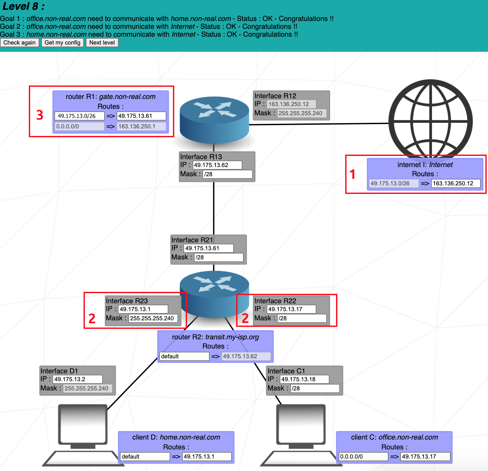

# NetPractice 가이드


<div id="top"></div>

---

## 목차

- [주요 개념](#주요-개념)
  - [TCP](#tcp-전송-계층)
  - [IP 주소](#ip-주소-네트워크-계층)
  - [서브넷 마스크](#서브넷-마스크)
  - [스위치](#스위치)
  - [라우터](#라우터)
- [예제](#예제)

## 주요 개념

### TCP: 전송 계층

</br>
<p align="center">
  
</p>
</br>

TCP는 **Transmission Control Protocol**의 약자다. 이것은 애플리케이션과 디바이스가 네트워크를 통해 메시지를 주고 받을 수 있도록 해주는 통신 표준이다. 인터넷을 통해 패킷을 보낼 때 사용한다.

TCP는 네트워크를 통해 보내는 데이터의 무결성을 보장한다. 데이터를 송신하기 전, TCP는 송신자와 수신자 사이에 연결을 생성하고, 이 연결은 통신이 시작하기 전까지 유지된다. 이후 데이터 손실 없이 많은 양의 데이터를 작은 패킷 단위로 쪼개어 보내게 된다.

<div align="right">
  <b><a href="#top">↥ 목차로 돌아가기</a></b>
</div>
</br>

---

### IP 주소: 네트워크 계층

</br>
<p align="center">
  <kbd></kbd>
</p>
</br>

IP는 TCP와 같이 인터넷 프로토콜의 일부이다. 이 둘을 함께 TCP/IP로 칭한다. 인터넷 프로토콜은 패킷화, 주소 부여, 전송, 라우팅, 네트워크를 통한 데이터 수신을 담당한다.

IP 주소 부여는 네트워크상의 디바이스에게 주소를 부여하는 논리적인 방법이다. 인터넷에 연결된 디바이스는 각자 고유한 IP 주소가 필요하다.

IP 주소는 두 부분으로 구성된다. 한 부분은 컴퓨터 등의 디바이스에 부여된 번호, 다른 부분은 이들이 소속된 네트워크의 번호이다. [서브넷 마스크](#서브넷-마스크)를 통해 TCP/IP에서 어디까지가 첫 부분이고 어디부터가 나머지 부분인지 구분할 수 있다.
</br>
</br>

#### IPv4 vs. IPv6

IP 주소에는 IPv4와 IPv6의 두 가지 버젼이 있다.
<br>

<p align="center">
  <kbd></kbd>
</p>
<br>

Internet Protocol version 4 (IPv4)는 32비트 정수를 사용해 IP 주소를 부여한다. 하지만 인터넷이 성장하여 사용 가능한 IPv4 주소가 고갈됨에 따라 IP의 새로운 버젼 IPv6가 등장했다. IPv6는 128비트 정수를 사용하는 체계로 1998년에 표준화되었다. 하지만, NetPractice에서는 IPv4 체계만을 사용한다.
</br>
</br>

#### 공인 IP vs. 사설 IP

공인 IP는 인터넷상 어디서나 직접 접근할 수 있는 주소로서 인터넷 서비스 공급자 (ISP)가 네트워크 라우터에 부여하는 주소다. 공인 IP는 한 네트워크 내부에서 인터넷으로, 또는 그 반대로 통신하게 해 준다.

사설 IP는 네트워크 라우터가 디바이스에 부여하는 주소다. 같은 네트워크 내의 모든 디바이스는 고유한 사설 IP를 부여받는다. 이를 통해 네트워크 내부에서 각 디바이스들이 서로 통신할 수 있다.

한 네트워크를 인터넷에 연결할 때 사설 IP로 사용해야하는 주소는 사용할 수 없다. 다음 IP 주소는 사설 IP로 사용하도록 정의된 주소다.

```
192.168.0.0 – 192.168.255.255 (65,536개 주소)
172.16.0.0 – 172.31.255.255   (1,048,576개 주소)
10.0.0.0 – 10.255.255.255     (16,777,216개 주소)
```

<div align="right">
  <b><a href="#top">↥ 목차로 돌아가기</a></b>
</div>
</br>

---

### 서브넷 마스크

</br>
<p align="center">
  <kbd></kbd>
</p>
</br>

서브넷 마스크는 32비트 (4바이트)의 정수 주소로서 IP 주소값 중 어느 부분이 네트워크 주소이고 어느 부분이 호스트 주소인지 구분할 때 사용한다. 서브넷 마스크는 네트워크나 서브넷 안에서 사용할 수 있는 IP 주소의 범위를 정의한다.
</br>
</br>

#### 네트워크 주소를 찾는 법

위에 표시된 _Interface A1_ 은 다음 속성을 가지고 있다.

```
IP address | 104.198.241.125
Mask       | 255.255.255.128
```

IP 주소 중 어느 부분이 네트워크 주소인지 알기 위해 여기에 마스크를 적용해야 한다. 우선 마스크를 2진수로 표시한다.

```
Mask | 11111111.11111111.11111111.10000000
```

비트 값이 1로 설정된 부분은 네트워크 주소를, 0으로 설정된 부분은 호스트 주소를 의미한다. IP 주소 또한 2진수로 표시하면:

```
IP address | 01101000.11000110.11110001.01111101
Mask       | 11111111.11111111.11111111.10000000
```

이제 마스크와 IP 주소에 [비트 AND 연산](https://en.wikipedia.org/wiki/Bitwise_operation#AND)을 적용하여 네트워크 주소를 구할 수 있다.

```
Network address | 01101000.11000110.11110001.00000000
```

이는 10진수로 `104.198.241.0`로 표현할 수 있다.
</br>
</br>

#### 호스트 주소의 범위 구하기

이 네트워크에서 사용할 수 있는 호스트 주소의 범위를 구하려면 호스트 주소에 사용할 수 있는 비트가 어디까지인지 파악해야 한다. 이전 예시에서 사용된 IP 주소와 마스크를 보면:

```
IP address | 01101000.11000110.11110001.01111101
Mask       | 11111111.11111111.11111111.10000000
```

호스트 주소의 범위는 마스크의 마지막 7개 비트 (연속하여 0이 나타나는 부분)으로 파악할 수 있다. 그러므로 호스트 주소의 범위는:

```
이진법  | 0000000 - 1111111
십진법  | 0 - 127
```

이 네트워크에 사용할 수 있는 IP 주소의 범위를 구하려면 네트워크 주소에 호스트 주소의 범위를 더하면 된다. 따라서 가용 IP 주소의 범위는 `104.198.241.0 - 104.198.241.127`가 된다.

<ins>하지만</ins>, 이 범위에서 경계값은 특별한 목적을 위해 사용해야 하므로 어느 인터페이스에게 부여해서는 안 된다.

```
104.198.241.0   | 네트워크 자체에게 부여된 주소
104.198.241.127 | 브로드캐스트 주소(네트워크 내 모든 호스트에게 패킷을 보내기 위한 주소)
```

그러므로 실제 가용 IP 주소의 범위는 `104.198.241.1 - 104.198.241.126`가 된다. [IP calculator](https://www.calculator.net/ip-subnet-calculator.html)를 사용하면 이를 계산해낼 수 있다.
</br>
</br>

#### CIDR 표기법 (/24)

마스크는 Classless Inter-Domain Routing (CIDR) 표기법을 통해서도 표기할 수 있다. CIDR은 슬래시 "/" 뒤에 네트워크 주소로 사용할 비트의 개수를 표기함으로서 마스크를 표현한다.

따라서 위 예시에서 사용한 마스크 `255.255.255.128`은 앞 25개의 비트를 네트워크 주소로 사용하므로 CIDR 표기법에서는 `/25`로 표기할 수 있다.

<div align="right">
  <b><a href="#top">↥ 목차로 돌아가기</a></b>
</div>
</br>

---

### 스위치

</br>
<p align="center">
  <kbd></kbd>
</p>
</br>

스위치는 한 네트워크 내부의 여러 디바이스를 연결한다. 라우터와 달리 스위치는 로컬 네트워크에 패킷을 배분하는 일만 할 수 있기 때문에 인터페이스를 가지지 않고 네트워크 외부에 직접 통신할 수 있는 능력도 없다.

<div align="right">
  <b><a href="#top">↥ 목차로 돌아가기</a></b>
</div>
</br>

---

### 라우터

</br>
<p align="center">
  <kbd></kbd>
</p>
</br>

한 네트워크에서 여러 디바이스를 연결하는 스위치처럼 라우터는 여러 네트워크를 연결하는 역할을 맡는다. 라우터는 자신이 연결된 각 네트워크에 대해 인터페이스를 가진다.

라우터는 각 네트워크를 구분하는 역할을 하기 때문에 각 인터페이스에 할당된 IP 주소의 범위가 겹쳐서는 안 된다. IP 주소의 범위가 겹친다면 해당 인터페이스들은 같은 네트워크에 있는 것이다.
</br>
</br>

#### 라우팅 테이블

</br>
<p align="center">
  <kbd></kbd>
</p>
</br>

라우팅 테이블은 라우터나 호스트가 가지고 있는, 특정 목적지 네트워크로 향하는 경로의 목록이다. NetPractice에서는 라우팅 테이블은 2개 요소로 이루어져 있다.

- **Destination**: Destination은 패킷의 최종 목적지가 될 호스트의 네트워크 주소를 나타낸다. `default`나 `0.0.0.0/0`는 어떤 IP 목적지 주소로 갈 수 있는 경로가 없을 시에 선택되는 경로다. 기본 경로는 특정 목적지를 표시하지 않고 next-hop 주소로 패킷을 전달할 것이다. 기본 경로는 어떤 네트워크에도 적용될 수 있다.

- **Next hop**: Next hop은 패킷이 전달될 수 있는 다음 라우터의 IP 주소다. 모든 라우터는 라우팅 테이블에 next hop 주소를 포함하여 관리해야 한다.

<div align="right">
  <b><a href="#top">↥ 목차로 돌아가기</a></b>
</div>
</br>

## 예제

<details>
  <summary>Level 1</summary>
  <br>
    
  <br>
  <br>

**1.** _Client A_ 와 _Client B_ 가 같은 네트워크에 있기 때문에 이들의 IP 주소는 서브넷 마스크를 적용했을 시 같은 네트워크에 있다는 결과가 나와야 한다.
<br>
서브넷 마스크의 값은 _255.255.255.0_ 이므로 IP 주소의 첫 3개 바이트는 네트워크 주소, 나머지 1개 바이트는 호스트 주소다. 둘은 같은 네트워크에 있기 때문에 네트워크 주소는 동일해야한다.
<br>
정답은 다음 3개 주소를 제외한 **102.96.23.0** 에서 **104.96.23.255** 사이의 모든 값이다.

- **104.96.23.0:** 가용 주소 범위에서 첫 번째 주소 (이 경우에는 0)는 네트워크 자체에 부여된 주소이므로 호스트가 사용할 수 없다.
- **104.96.23.255:** 가용 주소 범위에서 마지막 주소 (이 경우에는 255)는 브로드캐스트 주소로 사용된다.
- **104.96.23.12:** 이 주소는 이미 _Client B_ 가 사용중이다.

**2.** _1번_ 과 같은 원리로 해결할 수 있다. 1번과 다른 점은 서브넷 마스크가 _255.255.0.0_ 이므로 IP 주소의 처음 2개 바이트는 네트워크 주소, 마지막 2개는 호스트 주소를 나타낸다는 점이다.
<br>
정답은 다음 값을 제외한 **211.191.0.0** 에서 **211.191.255.255** 사이의 모든 값이다.

- **211.191.0.0:** 네트워크 주소
- **211.191.255.255:** 브로드캐스트 주소
- **211.191.89.75:** _Client C_ 가 사용중인 주소

<div align="right">
  <b><a href="#top">↥ 목차로 돌아가기</a></b>
</div>
</br>

</details>

---

<details>
  <summary>Level 2</summary>
  <br>
  
  <br>
  <br>

**1.** _Client B_ 와 _Client A_ 는 같은 사설 네트워크에 소속되어 있기 때문에 정확히 동일한 서브넷 마스크를 가져야 한다.
<br>
정답은 **255.255.255.224**이다.

**2.** _255.255.255.224_ 의 값을 가진 서브넷 마스크를 이해하기 위해 IP 주소 _192.168.20.222_ 와 함께 이진수 형태로 표기해본다.

<center>

```
서브넷 마스크: 11111111.11111111.11111111.11100000
IP 주소      :   11000000.10101000.00010100.11011101
```

</center>
처음 27개 비트는 네트워크 주소, 마지막 5개 비트는 호스트 주소를 나타낸다.
<br>
같은 네트워크 내의 호스트는 IP 주소 중 처음 27개의 비트를 통일해야 하고 마지막 5개 비트만 바꿀 수 있다.
<br>
<br>
정답은 다음 범위 내의 주소가 된다.

```
이진법:  11000000.10101000.00010100.11000000 - 11000000.10101000.00010100.11011111
또는
십진법:  192.168.20.192 - 192.168.20.223
```

하지만 이 중 다음 주소는 제외해야 한다.
<br>

- **11000000.10101000.00010100.11000000:** 네트워크 주소 (마지막 5개 비트가 모두 0임에 주목)
- **11000000.10101000.00010100.11011111:** 브로드캐스트 주소 (마지막 5개 비트가 모두 1임에 주목)
- **11000000.10101000.00010100.11011110:** _Client B_ 가 이미 사용중인 주소

**3.** _Interface D1_ 의 서브넷 마스크에서 처음으로 슬래시 "/" 표기법이 등장한다. _/30_ 은 IP 주소에서 처음 30개 비트가 네트워크 주소, 나머지는 호스트 주소를 나타냄을 의미한다.

<center>

```
서브넷 마스크 /30: 11111111.11111111.11111111.11111100
```

</center>

이 수는 십진법으로 _255.255.255.252_ 로 표기할 수 있고, _Interface C1_ 의 서브넷 마스크와 일치한다.
<br>
<br>
정답은 다음 조건을 만족하는 주소 중 하나이다.

- _Client D_, _Client C_ 의 네트워크 주소, 즉 처음 30개 비트가 동일해야 한다.
- 호스트 주소, 즉 마지막 2개 비트는 전부 0이거나 전부 1일 수 없다.
- _Client D_, _Client C_ 의 주소가 달라야 한다.

<div align="right">
  <b><a href="#top">↥ 목차로 돌아가기</a></b>
</div>
</br>

</details>

---

<details>
  <summary>Level 3</summary>
  <br>
  
  <br>
  <br>

이 예제에서는 **스위치**(_Switch S_)가 처음으로 등장한다. 스위치는 여러 호스트를 같은 네트워크로 묶는 역할을 한다.
<br>
<br>

**1.** _Client A_, _Client B_, _Client C_ 는 모두 같은 네트워크에 있다. 따라서 이들은 모두 같은 서브넷 마스크를 가져야 한다. _Client C_ 가 이미 서브넷 마스크로 _255.255.255.128_ 을 가지고 있기 때문에 _Interface B1_ 과 _Interface A1_ 또한 서브넷 마스크를 _255.255.255.128_ 로 설정해야 한다. 또는 슬래시를 사용해 _/25_ 로 표기할 수 있다.
<br>
<br>

_Interface B1_ 과 *Interface C1*은 _Client A_ 와 같은 네트워크 범위 내에 있어야 한다. 네트워크 범위는 다음과 같다.

  <center>

```
104.198.241.0 - 104.198.241.128
```

  </center>
  물론 네트워크 주소와 브로드캐스트 주소는 제외해야 한다.

  <div align="right">
  <b><a href="#top">↥ 목차로 돌아가기</a></b>
</div>
</br>

</details>

---

<details>
  <summary>Level 4</summary>
  <br>
  
  <br>
  <br>

이 예제에서는 **라우터**가 처음으로 등장한다. 라우터는 여러 네트워크를 연결하는 역할을 한다. 이는 라우터가 여러 인터페이스 (여기에선 _Interface R1_, _Interface R2_, _Interface R3_)를 갖고 있기 때문에 가능하다.
<br>
<br>

**1.** _Interface B1_, _Interface A1_, _Interface R1_ 중 어느 곳에도 서브넷 마스크가 지정되어 있지 않기 때문에 자유롭게 선택하여 기입할 수 있다. **/24**를 마스크로 선택하는 것이 이상적이다. 마지막 4번째 바이트를 전부 호스트 주소에 사용할 수 있고 이진법을 사용해 호스트 범위를 계산하지 않아도 되기 때문이다.
<br>
<br>

_Interface B1_ 과 _Interface R1_ 의 네트워크 주소는 _Interface A1_ 과 동일해야 한다. 서브넷 마스크가 _/24_ 이므로 가용 범위는 다음과 같다.

  <center>

```
85.17.5.0 - 85.17.5.255
```

  </center>
  역시 네트워크 주소와 브로드캐스트 주소는 제외한다.
  <br>
  <br>

이 예제에서는 _Interface R2_ 및 _Interface R3_ 방향으로는 연결될 것을 요구하지 않으므로 이들과는 통신하지 않았음에 유의하라.

  <div align="right">
  <b><a href="#top">↥ 목차로 돌아가기</a></b>
</div>
</br>

</details>

---

<details>
  <summary>Level 5</summary>
  <br>
  
  <br>
  <br>

이 예제에서는 **경로**가 등장한다. 한 경로에는 2개 필드를 입력할 수 있는데, 첫 필드는 아웃바운드 패킷의 **destination**이고 두번째 필드는 패킷의 **next hop**이다.
<br>

_default_ **destination**은 _0.0.0.0/0_ 과 동일하고 이는 패킷을 가장 먼저 등장한 네트워크 주소로 구별 없이 보낸다는 뜻이다. destination 주소가 _122.3.5.3/24_ 라면 패킷은 _122.3.5.0_ 로 전송될 것이다.

  <br>

**next hop**은 현재 기기의 인터페이스가 패킷을 보내야 하는 다음 라우터(또는 인터넷)의 인터페이스의 IP 주소다.
<br>
<br>

**1.** _Client A_ 가 패킷을 보낼 수 있는 경로는 오직 하나이므로 여러 개의 destination을 고려할 필요가 없다. _default_ destination으로 온 모든 패킷은 유일하게 가능한 경로로 보내질 것이다.
<br>
<br>

next hop의 주소는 패킷을 전달할 다음 라우터의 인터페이스의 IP 주소가 되어야 한다. 다음 인터페이스는 _Interface R1_ 이고 그 주소는 _54.117.30.126_ 이다. _Interface A1_ 은 송신자의 인터페이스이기 때문에 다음 인터페이스로 지정하지 않는다는 점에 주의하라.

  <div align="right">
  <b><a href="#top">↥ 목차로 돌아가기</a></b>
</div>
</br>

</details>

---

<details>
  <summary>Level 6</summary>
  <br>
  
  <br>
  <br>

이 예제에서는 **인터넷**이 등장한다. 인터넷은 라우터처럼 동작한다. 다만 어떤 인터페이스가 인터넷에 직간접적으로 연결되려면 다음의 예약된 IP 주소 범위 내의 주소를 가지고 있으면 안 된다.

```
192.168.0.0 - 192.168.255.255 (65,536 개 IP 주소)
172.16.0.0 - 172.31.255.255   (1,048,576 개 IP 주소)
10.0.0.0 - 10.255.255.255     (16,777,216 개 IP 주소)
```

**1.** 인터넷의 **next hop**이 이미 지정되어 있고 _Interface R2_ 의 IP 주소와 일치한다. 따라서 인터넷의 destination만 파악하면 된다.
<br>
<br>

인터넷은 _Client A_ 에게 패킷을 보내야 한다. 그러기 위해서는 인터넷의 destination이 _Client A_ 의 네트워크 주소와 일치해야 한다. _Client A_ 의 네트워크 주소를 구하려면:
<br>

_Client A_ 의 마스크는 _255.255.255.128_ 이고 이는 _/25_ 와 동일하다. 이는 IP 주소의 첫 25개 비트가 네트워크 주소라는 것을 의미한다. 따라서 IP 주소의 첫 3개 바이트(24개 비트)는 확실히 네트워크 주소의 일부임을 알 수 있다.

  <center>

```
40.178.145.?
```

  </center>

남은 25번째 비트가 1인지 0인지 파악하면 된다.
<br>

227을 이진법으로 표기하면 `11100011`이 된다. 25번째 비트에 해당하는 첫 자릿수는 1이다. 네트워크 주소에 첫 1개 비트는 해당되고 마지막 7개 비트는 제외되기 때문에 네트워크 주소의 마지막 바이트는 `1000000`이 되고 이는 십진법으로 128이다.
<br>
<br>
완전한 네트워크 주소는 다음과 같다.

  <center>

```
40.178.145.128
```

  </center>

이 네트워크에서는 호스트가 _40.178.145.129 - 40.178.145.254_ 범위 내의 주소를 가질 수 있다.
<br>
<br>

이제 **40.178.145.128**을 인터넷의 destination 주소에 기입할 수 있다. 주소 뒤에 붙는 **/25**는 주소에 적용될 마스크를 뜻한다.
<br>
<br>
destination에 _40.178.145.227/25_ 을 기입하는 것은 _40.178.145.128/25_ 와 동일한 결과를 가져온다. 마스크가 _/25_ 이므로 25번째 비트 이후의 비트는 모두 0으로 전환되기 때문이다.

  <div align="right">
  <b><a href="#top">↥ 목차로 돌아가기</a></b>
</div>
</br>

</details>

---

<details>
  <summary>Level 7</summary>
  <br>
  
  <br>
  <br>

이 예제에서는 **주소 겹칩**의 개념이 등장한다. 네트워크의 IP 범위는 다른 네트워크의 IP 범위와 중복되어서는 안된다. 네트워크는 라우터에 의해 구분된다.
<br>
<br>

**1.** 3개의 네트워크가 구분되도록 해야한다.
<br>

1. _Client A_ 와 _Router R1_
2. _Router R1_ 과 _Router R2_
3. _Router R2_ 와 _Client C_

_Interface A1_ 에서는 _Interface R11_ 의 IP가 이미 정해졌기 때문에 IP 주소를 자유롭게 고를 수 없다. 또한 마스크를 _/24_ 로 지정할 경우 IP 주소 범위가 이미 지정된 _Interface R12_ 의 범위와 겹치게 된다. 이 둘은 모두 _93.198.14.0 - 93.198.14.255_ 의 주소 범위를 가지게 된다.
<br>
<br>

현재 3개의 구분되는 네트워크의 주소가 필요하기 때문에 주소에서 마지막 바이트를 4개 이상의 범위로 구분할 수 있다면 편리할 것이다. 마스크의 값이 _/26_ 이상이 된다면 가능하다. 예를 들어 마스크가 _/28_ 이라면 16개의 범위로 구분할 수 있고 이 중 3개 범위를 다음과 같이 사용한다.

```
93.198.14.1 - 93.198.14.14    (Client A 에서 Router R1)
93.198.14.65 - 93.198.14.78   (Router R1 에서 Router R2)
93.198.14.241 - 93.198.14.254 (Router R2 에서 Client C)
```

마스크 값에 따른 가능한 주소 범위를 계산하려면:
<br>
https://www.calculator.net/ip-subnet-calculator.html?cclass=any&csubnet=28&cip=93.198.14.2&ctype=ipv4&printit=0&x=97&y=13

  <div align="right">
  <b><a href="#top">↥ 목차로 돌아가기</a></b>
</div>
</br>

</details>

---

<details>
  <summary>Level 8</summary>
  <br>
  
  <br>
  <br>

**1.** _Client C_ 와 _Client D_ 두 호스트는 인터넷으로 패킷을 보낼 것이고 인터넷은 원래의 송신자에게 다시 패킷을 응답할 것이다. 이 패킷들을 보내기 위해 인터넷은 _49.175.13.0/26_ 을 destination으로 활용하며 이 네트워크의 범위는 `49.175.13.0 - 49.175.13.63`이다.
<br>
<br>
모든 패킷을 받는 네트워크는 그 범위가 중복되지 않으면서 위 범위 안에 있어야 한다.
<br>
<br>

**2.** _Interface R23_ 과 _Interface R22_ 에서는 _255.255.255.240_ (또는 _/28_)을 마스크로 지정하여 destination에 부여된 _/26_ 네트워크를 4개 구분된 네트워크로 나눌 수 있다. 이 예제에서 다음 3개의 네트워크를 구분해야 하기 때문에 최소 4개의 구분된 네트워크가 필요하다.
<br>

1. _Router R1_ 에서 _Router R2_
2. _Router R2_ 에서 _Client C_
3. _Router R2_ 에서 _Client D_

각 네트워크의 마스크는 _/28_ 이므로 다음 IP 범위로 나누어진다.

```
49.175.13.0 - 49.175.13.15
49.175.13.16 - 49.175.13.31
49.175.13.32 - 49.175.13.47
49.175.13.48 - 49.175.13.63
```

네트워크 주소 (첫 주소)와 브로드캐스트 주소 (마지막 주소)는 각 범위에서 제외되어야 함을 상기하라.
<br>
<br>

**3.** 인터넷을 향한 destination과 next hop은 이미 입력되어 있다. _Router R2_ 를 향한 next hop, 즉 _Interface R21_ 의 IP만 입력하면 된다.

<div align="right">
  <b><a href="#top">↥ 목차로 돌아가기</a></b>
</div>
</br>

</details>

---

<details>
  <summary>Level 9</summary>
  <br>
  
  <br>
  <br>

이 예제는 인터넷이 특정 네트워크로 곧바로 패킷을 전송하지 않기 때문에 간단한 편이다. 따라서 각 네트워크가 공통된 주소 범위를 공유할 필요가 없다. 예제가 완료될 때까지 단순히 6개의 골을 달성하는 것을 추천한다.
<br>
<br>
예약된 사설 IP의 주소를 사용하지 않도록 주의하라.
<br>
<br>

**1.** **Goal 3**을 달성하려면 _meson_ 이 인터넷에 연결되어야 한다. 인터넷은 *meson*에게 응답해야 하므로 인터넷의 destination에 *meson*의 네트워크 주소를 입력한다.
<br>
<br>

**Goal 6**을 달성하려면 _cation_ 이 인터넷에 연결되어야 한다. 따라서 _cation_ 의 네트워크 주소를 인터넷의 destination에 입력한다.
<br>
<br>

인터넷의 세번째 destination과 _Router R1_ 의 destination이 비어 있어도 무방하다. 라우팅 테이블의 모든 칸이 채워질 필요는 없다.

  <div align="right">
  <b><a href="#top">↥ 목차로 돌아가기</a></b>
</div>
</br>

</details>

---

<details>
  <summary>Level 10</summary>
  <br>
  
  <br>
  <br>

이 예제에는 4개의 네트워크가 있다.
<br>

1. _Router R1_ 에서 _Switch S1_
2. _Router R1_ 에서 _Router R2_
3. _Router R2_ 에서 _Client H4_
4. _Router R2_ 에서 _Client H3_
   <br>

**1.** 인터넷이 모든 호스트에게 패킷을 보낼 수 있어야 하므로 destination은 모든 호스트의 네트워크의 범위를 포함해야 한다.
<br>
<br>

_Interface R11_ 과 _Interface R13_ 은 이미 IP 주소가 입력되어 있다. 두 주소에서 다른 부분은 마지막 바이트뿐이다. _Interface R11_ 의 마지막 바이트는 **1**이고 _Interface R13_ 의 마지막 바이트는 **254**다. 이 두 주소를 모두 포함하는 범위를 지정하기 위해 인터넷의 destination의 마스크를 **/24**로 지정해야 한다. destination은 `70.101.30.0 - 70.101.30.255`의 범위를 가지게 된다.

  <br>
  <br>

**2.** IP 주소를 고를 때 2가지 사항을 고려해야 한다.
<br>

1. IP 주소가 인터넷의 destination의 범위 안에 있다.
2. 각 네트워크의 IP 주소 범위는 겹치지 않는다.
   <br>

이미 입력된 IP 주소를 통해서 각 네트워크가 가질 수 있는 주소의 범위를 구한다.
<br>

1. _Router R1_ 에서 _Switch S1_ - **70.101.30.0 - 70.101.30.127** (마스크 /25).
2. _Router R2_ 에서 _Client H4_ - **70.101.30.128 - 70.101.30.191** (마스크 /26).
3. _Router R1_ 에서 _Router R2_ - **70.101.30.252 - 70.101.30.255** (마스크 /30).
4. _Router R2_ 에서 _Client H3_ - ??? (mask ???).

"Router R2에서 Client H3" 사이의 네트워크에 할당할 수 있는 남은 범위는 **70.101.30.192 - 70.101.30.251**다. 해당 범위 내에서 2개의 IP를 선택할 수 있도록 하는 임의의 마스크를 고른 후 _Interface R22_ 와 _Interface R31_ 에 기입한다.

  <div align="right">
  <b><a href="#top">↥ 목차로 돌아가기</a></b>
</div>
</br>

</details>
